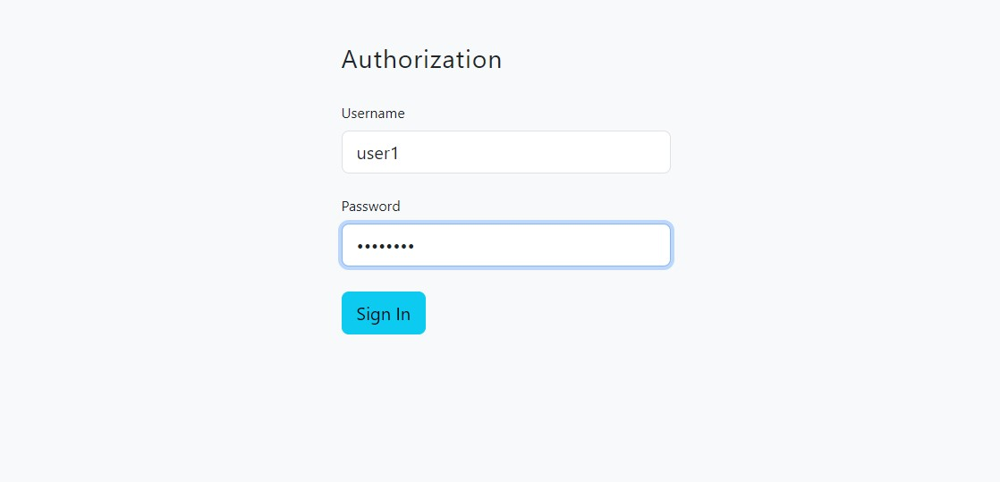
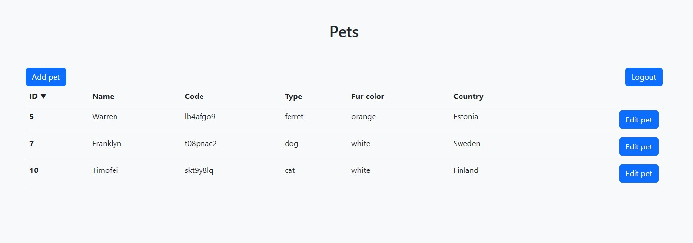
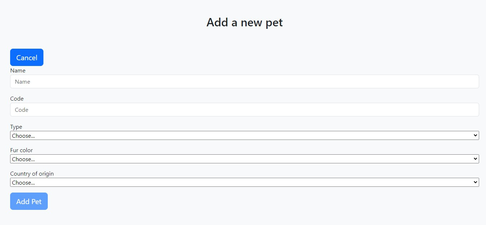
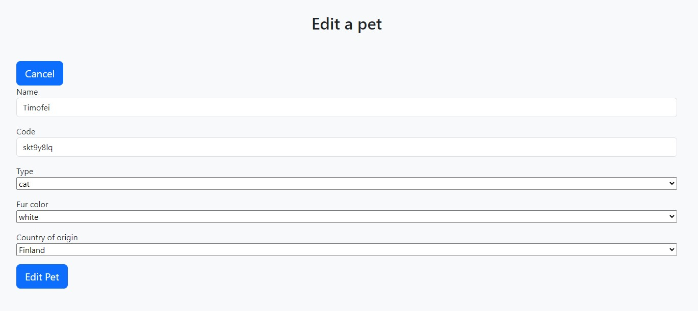

# Wisercat assignment (Spring Boot + Angular)
The following project was done as a solution for an internship test task and does not provide any meaningful functionalities.
 
## Prerequisites

* Java 20
* Maven 3.9.1
* Node 19.3.0
* NPM 9.6.4
* @angular/cli 15.2.2

## Running the project

1. Download .zip or clone the project from GitHub.

2. Unzip and go to the project's location in __terminal__.

3. Navigate to the /backend directory, build and run the backend 
   ```sh
   mvn spring-boot:run
   ```

4. In another terminal instance, navigate to /angular-front and run the frontend (will download node_modules automatically)
   ```sh
   npm start
   ```
   
5. Now you can use the application.

## NB! Built-in users
* user1:password
* user2:password
* user3:password

## Screenshots




